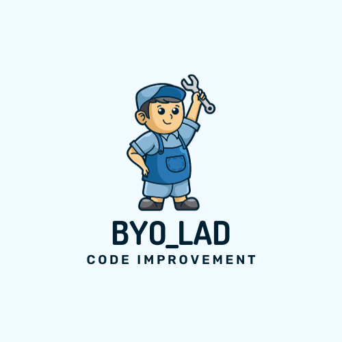
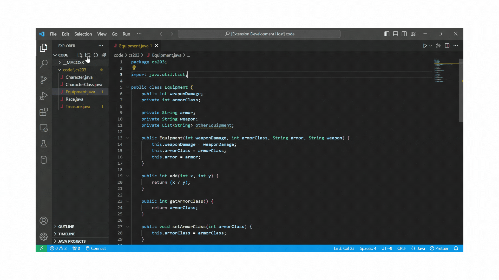

# byoLAD: Your code improvement buddy

byoLAD (bring your own LLM Augmented Development) augments your development experience by bringing your LLM AI into VSCode. byoLAD enables you to configure your own Large Language Model (LLM) API, so you can control who sees your data and how much you spend. You manage your account directly with your LLM provider. 

#### LLM Providers Currently Supported: 
- [OpenAI](https://openai.com/blog/openai-api)
    - [models](https://platform.openai.com/docs/models/overview)
    - [API Key](https://platform.openai.com/docs/api-reference/authentication)
- [Google](https://developers.generativeai.google/)
    - [models](https://developers.generativeai.google/models/language)
    - [API Key](https://developers.generativeai.google/tutorials/setup)
  

## Features

- Chat with AI directly in VSCode
  - Easily add code to chats
  - Easily insert AI-generated code into the editor
- Save and continue multiple chats in a workspace

## Set Up

After installing the byoLAD extension, configure it with your API key from your LLM provider. 

#### How to set your API key in settings:
- Go to File and under Preferences select Settings.
- Once in Settings, click on Extensions.
- Then select byoLAD under Extensions.
- Then under APIKey put in your API key from your provider.
- Then under Model enter the model you desire to use of your LLM provider's API.

> Note: If you want to run the extension locally, go to [contribute.md](contribute.md)

**If you want to contribute, see our [contribution page](contribute.md).**

[Bean Lab](https://github.com/beanlab)
<!--  -->
