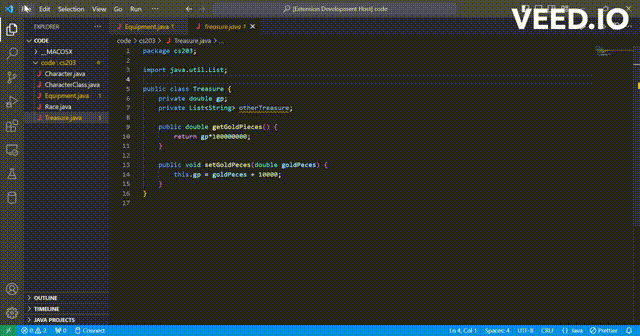

# byoLAD

byoLAD augments your development experience by reviewing your code, identifying errors, adding documentation, and suggesting general improvements.  Since byoLAD is open-source, you can modify prompts and other configurations to your liking. 

In addition, byoLAD enables you to use your own Large Language Model (LLM) API, so you can use your favorite AI and control how much you spend. We don't add any extra costs, and there are no extra parties looking at your data. You only have to manage your account with your LLM provider. 
#### LLM Providers Currently Supported: 
- [OpenAI](https://openai.com/blog/openai-api)
- [Google](https://developers.generativeai.google/)

## Features

- Option to review a whole file or just a piece of selected code
- Suggests formatting improvements (like getting rid of extra lines to make it easier to read)
- Identifies bugs in code
- Adds Documentation
- Checks Spelling
- Suggests general code improvements

## Set Up

After installing the byoLAD extension, configure it with your API key from your LLM provider. 
#### How to set your API key in settings:
- Go to File and under Preferences select Settings.
- Once in Settings, click on Extensions.
- Then select byoLAD under Extensions.
- Then under APIKey put in your API key from your provider.
- Then under Model select your LLM provider's API.

> Note: If you want to run the extension locally, go to [contribute.md](contribute.md)

**Want to learn more about the creators?** 

**Want to contribute to byoLAD? See [contribute.md](contribute.md)**
