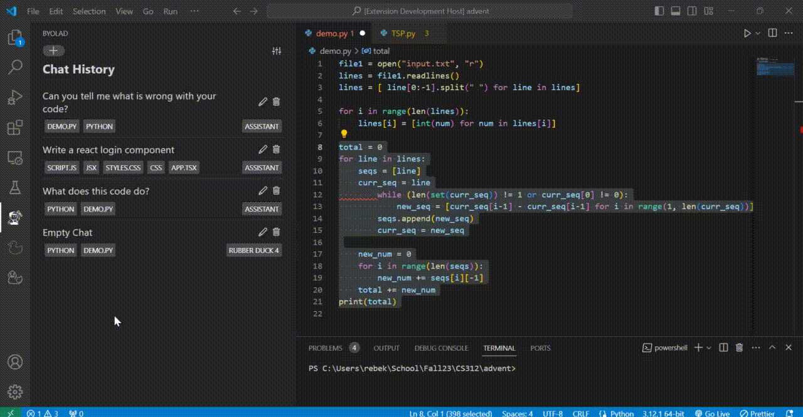
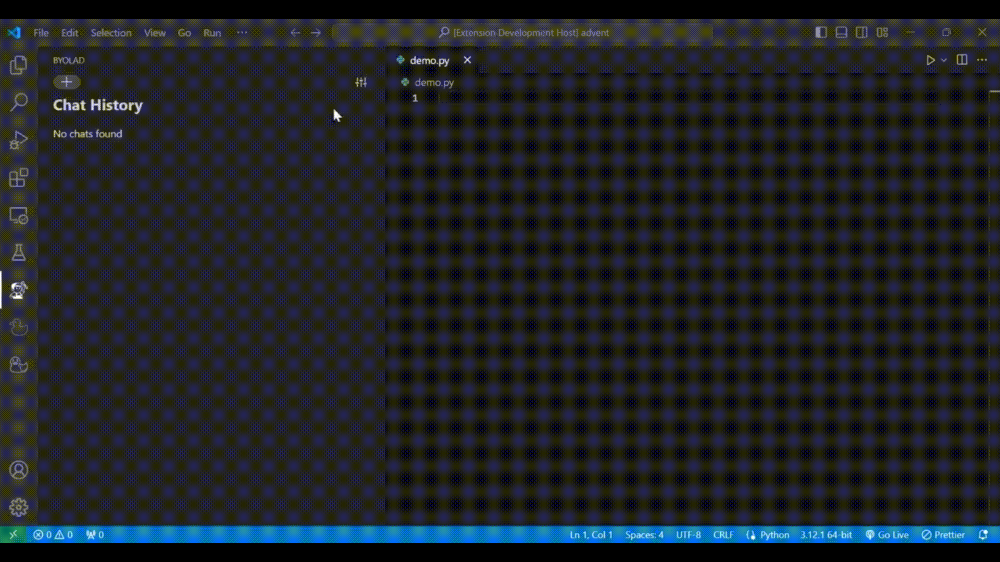
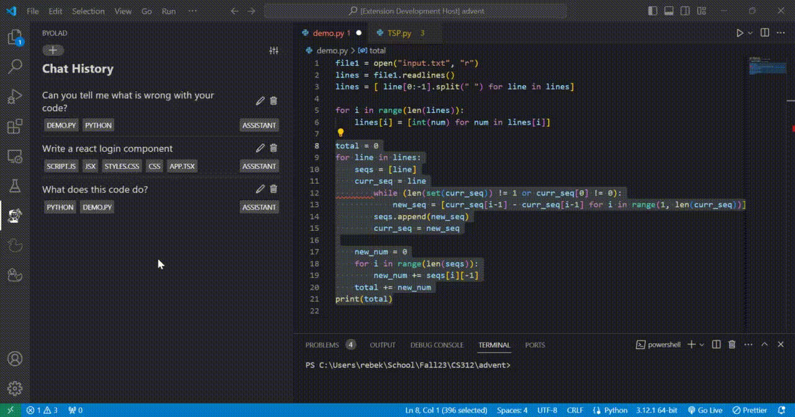

# byoLAD: Your code improvement buddy

byoLAD (bring your own LLM Augmented Development) augments your development experience by bringing your LLM AI into VSCode. byoLAD enables you to configure your own Large Language Model (LLM) API, so you can control who sees your data and how much you spend. You manage your account directly with your LLM provider. You can also manage your own personas. 

## Features

- Chat with AI directly in VSCode
  - Easily add code to chats
  - Easily insert AI-generated code into the editor
- Save and continue multiple chats in a workspace
- Use different personas
  - Use default personas of "Assistant" and "Rubber Duck"
  - Easily create and use your own personas 

## Set Up

After installing the byoLAD extension, configure it with your API key from your LLM provider. 

#### How to set your API key in settings:
- Click the settings icon in the upper right hand corner
- Once on the settings page, Click the key icon in the top right corner
- Select your desired provider
- Paste your API key from your provicer

#### How to switch between Personas:
- Open a chat
- Click on the top right drop down menu
- Chose your desired persona

 

#### How to add a persona:
- Create a new chat
- Select settings in the top right
- Click "Create Persona"
- Fill in the name, description, model, and prompt instructions

 

#### LLM Providers Currently Supported: 
- [OpenAI](https://openai.com/blog/openai-api)
    - [models](https://platform.openai.com/docs/models/overview)
    - [API Key](https://platform.openai.com/docs/api-reference/authentication)
- [Google](https://developers.generativeai.google/)
    - [models](https://developers.generativeai.google/models/language)
    - [API Key](https://developers.generativeai.google/tutorials/setup)

> Note: If you want to run the extension locally, go to [contribute.md](contribute.md)

**If you want to contribute, see our [contribution page](contribute.md).**

    
    
<a href="https://github.com/beanlab">Bean Lab</a>

