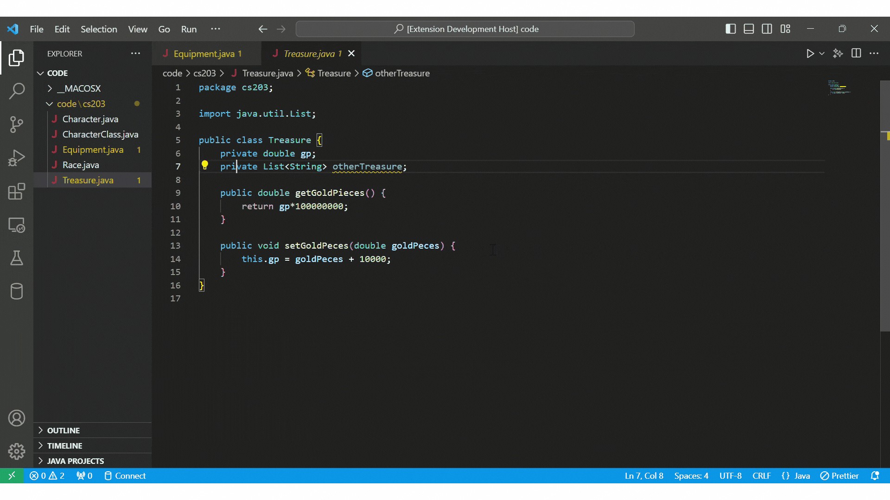
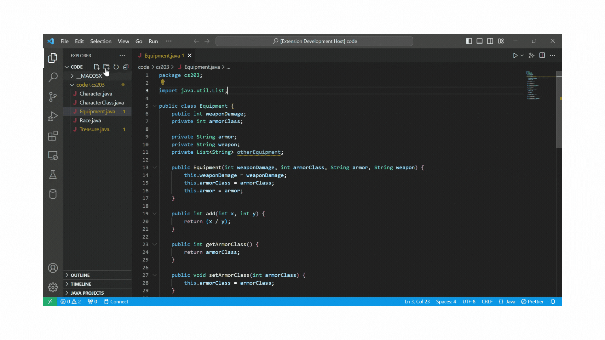

# byoLAD: Your code improvement buddy

byoLAD augments your development experience by reviewing your code, identifying errors, adding documentation, and suggesting general improvements. Since byoLAD is open-source, you can modify prompts and other configurations to your liking.

In addition, byoLAD enables you to use your own Large Language Model (LLM) API, so you can use your favorite AI and control how much you spend. We don't add any extra costs, and there are no extra parties looking at your data. You manage your account directly with your LLM provider.

#### LLM Providers Currently Supported:

- [OpenAI](https://openai.com/blog/openai-api)
  - [models](https://platform.openai.com/docs/models/overview)
  - [API Key](https://platform.openai.com/docs/api-reference/authentication)
- [Google](https://developers.generativeai.google/)
  - [models](https://developers.generativeai.google/models/language)
  - [API Key](https://developers.generativeai.google/tutorials/setup)



## Features

- Option to review a whole file or just a piece of selected code
- Suggests formatting improvements
- Identifies bugs in code
- Adds Documentation
- Suggests general code improvements

## Set Up

After installing the byoLAD extension, configure it with your API key from your LLM provider.

#### How to set your API key in settings:

- Go to File and under Preferences select Settings.
- Once in Settings, click on Extensions.
- Then select byoLAD under Extensions.
- Then under APIKey put in your API key from your provider.
- Then under Model enter the model you desire to use of your LLM provider's API.
  
  > Note: If you want to run the extension locally, go to [contribute.md](contribute.md)

**Contributions of any kind welcome.**

<!--  -->

---

---

---

**Below simply the README from https://github.com/rebornix/vscode-webview-react**

---

---

# VSCode Webview React

This project was bootstrapped with

- [Create React App](https://github.com/facebookincubator/create-react-app)
- [Create React App TypeScript](https://github.com/wmonk/create-react-app-typescript)
- [VSCode Extension Webview Sample](https://github.com/Microsoft/vscode-extension-samples/tree/master/webview-sample)

[The webview API](https://code.visualstudio.com/docs/extensions/webview) allows extensions to create customizable views within VSCode. Single Page Application frameworks are perfect fit for this use case. However, to make modern JavaScript frameworks/toolchains appeal to VSCode webview API's [security best practices](https://code.visualstudio.com/docs/extensions/webview#_security) requires some knowledge of both the bundling framework you are using and how VSCode secures webview. This project aims to provide an out-of-box starter kit for Create React App and TypeScript in VSCode's webview.

## Development

Run following commands in the terminal

```shell
yarn install --ignore-engines
yarn run build
```

And then press F5, in Extension Development Host session, run `Start React Webview` command from command palette.

## Under the hood

Things we did on top of Create React App TypeScript template

- We inline `index.html` content in `src/extension.ts` when creating the webview
- We set strict security policy for accessing resources in the webview.
  - Only resources in `/build` can be accessed
  - Onlu resources whose scheme is `vscode-resource` can be accessed.
- For all resources we are going to use in the webview, we change their schemes to `vscode-resource`
- Since we only allow local resources, we add a `.env` file which sets `PUBLIC_URL` to `./` and after bundling, resource urls will be relative. (unneeded in byoLAD)
- We add baseUrl `<base href="${vscode.Uri.file(path.join(this._extensionPath, 'build')).with({ scheme: 'vscode-resource' })}/">` and then all relative paths work.

## Limitations

Right now you can only run production bits (`yarn run build`) in the webview, how to make dev bits work (webpack dev server) is still unknown yet. Suggestions and PRs welcome !
